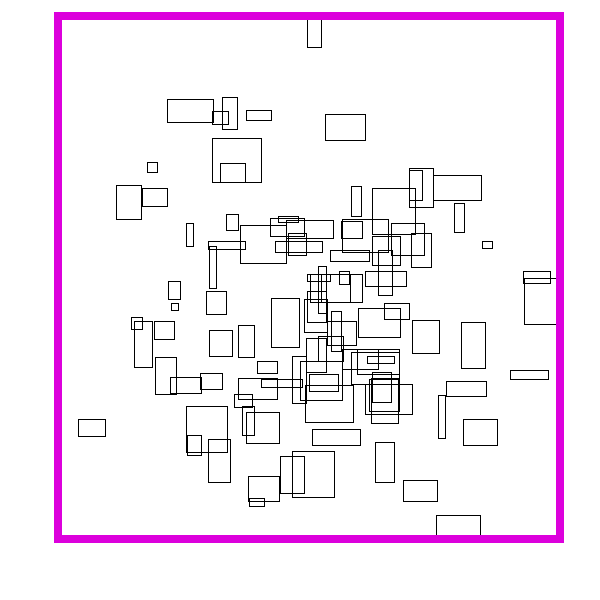
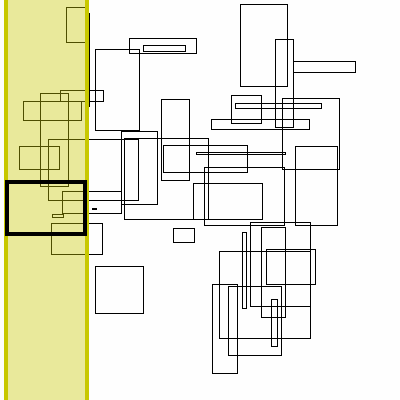
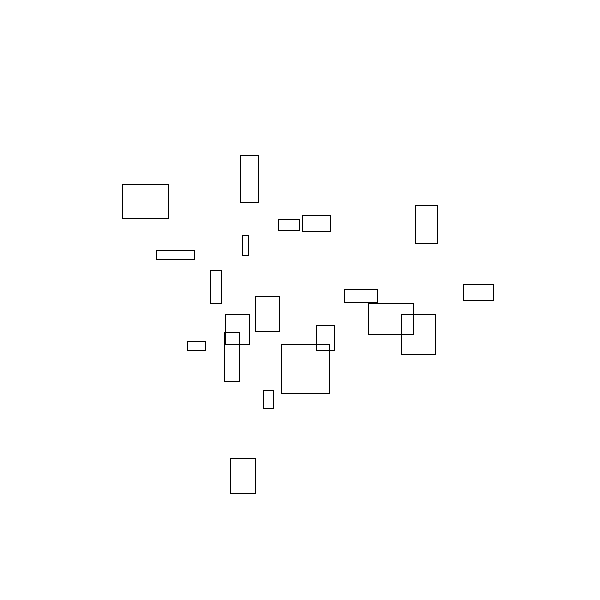

# Fast box intersection algorithm


Computes box intersection/overlap/density algorithms using efficient algorithms and data structures. Aspires offer a easy-to-use interface that "just works" on both smaller and larger datasets. Written in Rust with Python bindings.

* [Algorithm list](#Algorithms)
* [Python wrapper examples](#python-wrapper-examples)
* [Benchmark results](#benchmark-results)
* [Algorithmic ideas](#algorithmic-ideas)

## Algorithms

The primary data structure is for rectangle set intersection: a class which structures a static list of rectangles efficiently so that overlapping rectangles can be identified quickly. The interface is:

* `BoxIntersector`
    * `new(box_list)`: Creates the immutable box intersector with the following list of boxes.
    * `find_intersections(x1, y1, width, height) -> List[int]`: Finds all intersections with rectangle defined by `(x1, y1, width, height)`. Returned list are the indexes in the input box list

The following algorithms are also avaliable:

* `find_intersecting_boxes(box_list)->list[list[int]]`: Returns all-to-all adjacency list of intersecting boxes.
* `find_intersecting_boxes_asym(source_boxes, dest_boxes)->list[list[int]]`: Returns source-to-dest adjacency list of intersecting boxes.
* `find_best_matches(box_list_1, box_list_2, iou_threshold: float)->tuple[list[tuple[int,int]],list[int],list[int]]`: Returns best unique matches between two given lists of boxes. Matches are only returned if they intersect and meet the Intersection over Union threshold (`iou_threshold`) and no other match with any unmatched box in the oposing list is better. A tuple of matches, remaining_list_1, remaining_list_2 is returned.
* `efficient_coverage(box_list, cover_rect_width, cover_rect_height)->list[tuple[tuple[int, int],list[int]]]`: A heuristic algorithm to try to quickly generate a small number of fixed-sized tiles to cover all the boxes in the box list. If any of the boxes are too large to fit in the tile, an error is raised.
* `find_non_max_suppressed(box_list, box_scores:list[float], iou_threshold:float,overlap_threshold:float)->list[bool]`: Identifies similar boxes in set with more overlap than the two thresholds specify, and suppresses the lower confidence one. Standard algorithm to deduplicate boxes in object detection frameworks.

## Python wrapper

Install with `pip install box-intersect-lib-py`

### Build instructions

If pip install fails, due to prebuilt binary wheels not being avaliable on your platform, try:

1. If you don't have rust installed, install with `curl https://sh.rustup.rs -sSf | sh
` [official installation docs](https://doc.rust-lang.org/cargo/getting-started/installation.html)
2. Install python dependencies: `pip install maturin numpy`
3. Build wheel with `(cd box-intersect-lib-py && maturin build --release --strip)`
4. Previous step will put wheel in a local directory. IT should be install able with `pip install box-intersect-lib-py/target/wheels/*`

A dockerfile with all of this set containerized is provided in `Dockerfile.text`

### Usage:

```python
import box_intersect_lib_py
import numpy as np

# input is numpy array of boxes.
# boxes are left-anchored (x,y,width,height)
boxes = np.array([
    [1,1,1,2],
    [0,0,5,5],
    [2,3,2,6],
],dtype="int32")

results = box_intersect_lib_py.find_intersecting_boxes(boxes)

# 2nd box intersects with other 2
assert (results[0] == np.array([1])).all()
assert (results[1] == np.array([0,2])).all()
assert (results[2] == np.array([1])).all()

print(results)  # [array([1], dtype=uint32), array([0, 2], dtype=uint32), array([1], dtype=uint32)]

# get area of the relevant intersections
intersection_areas = [box_intersect_lib_py.intersect_area(boxes[i], boxes[results[i]]) for i in range(len(boxes))]
print(intersection_areas)  # [array([2], dtype=uint64), array([2, 4], dtype=uint64), array([4], dtype=uint64)]


# we can also build a data structure of boxes for efficient querying with arbirary other boxes
detector = box_intersect_lib_py.BoxIntersector(boxes)
query_box = (0,0,2,2)
intersecting_idxs = detector.find_intersections(*query_box)
print(intersecting_idxs) # [0, 1]
```

## Benchmark results

Running the following commands on my laptop (subject to signifiant noise):

```
python benchmark/run_benchmark.py --num-boxes 10000000 --region-size 100000 --max-box-size 100 --test-iterations 2
python benchmark/run_benchmark.py --num-boxes 1000000 --region-size 40000 --max-box-size 100 --test-iterations 5
python benchmark/run_benchmark.py --num-boxes 5000000 --region-size 40000 --max-box-size 100 --test-iterations 1
python benchmark/run_benchmark.py --num-boxes 10000 --region-size 4000 --max-box-size 100 --test-iterations 200
python benchmark/run_benchmark.py --num-boxes 50000 --region-size 4000 --max-box-size 100 --test-iterations 200
python benchmark/run_benchmark.py --num-boxes 100 --region-size 400 --max-box-size 100 --test-iterations 5000
python benchmark/run_benchmark.py --num-boxes 500 --region-size 400 --max-box-size 100 --test-iterations 5000
```

num boxes|num intersections| find_intersecting_boxes_t|find_non_max_suppressed_t|find_intersecting_boxes_linesearch_t|find_intersecting_boxes_asym_t|find_best_matches_t|find_rect_cover_t|BoxIntersector build|BoxIntersector query sequentially
---|---|---|---|---|---|---|---|---|---
10000000|98078592|12.169555259500157|7.491135403000044|136.2819793919998|16.957570917499652|18.989964099499957|2.2033966144999795|2.07134081949971|78.30415772001288
1000000|6141632|0.9191611845999432|0.6003980014000263|3.5016677132000043|1.086823502000334|1.1519274157999462|0.14588280299976758|0.1738209677998384|3.4725145600168617
5000000|153686102|7.358366684999055|2.962747178000427|87.27572011099983|11.088836232000176|16.82190396599981|0.6261364540005161|0.9347212379998382|23.502293479996297
10000|64484|0.006635849274998691|0.0034072973049933354|0.007089999469999384|0.00699314222000794|0.007134397955005625|0.0005728775550051068|0.001043458304993692|0.024413333800112014
50000|1588676|0.06341231076999974|0.017638188490000175|0.11677449097000135|0.06591738333499961|0.10906894315499813|0.0029347618249994413|0.006063540664999891|0.16421707900008187
100|732|3.0048768800043034e-05|6.568112400054815e-06|2.921996660006698e-05|2.89388543998939e-05|1.8404549999831942e-05|2.4175683996872975e-06|2.605749600115814e-06|0.00013785439200000838
500|20710|0.0005309709685996495|8.529535939997003e-05|0.0004740007478001644|0.0005328194969999459|0.0008529525551999541|9.667402999912156e-06|2.0378057800189707e-05|0.001288445912010502


## Algorithmic ideas

### Recursive Tile Sort (RTS) RTree

The idea is to build an RTree, essentailly a recursive interval tree where the sort axis swaps with each recursion down. Each node in the tree is a bounding box around a set of subnodes. The subnodes may overlap with each-other, so you have to check each child when doing recursive searches, similar to a B-Tree. This implementation uses an interval tree to store the sub-nodes, allowing for large sets of children, allowing for much flatter trees.

Building an efficient R-tree requires the use of recursive tile sort, hard to describe, but easier to visualize. Note that any method to build a valid R-tree will result in correct output, this method is only used to build an efficiently spatially partitioned R-tree.




### Reduction to a single dimension

This library used to do a simple reduction of 2d box overlap problems to a 1d interval overlap problem across the *x* axis, followed by brute force search across the *y* axis.

While asymtotically suboptimal, the resulting methods result in highly parallizable, cache-local, and predictable code flows, resulting in excelent performance on most datasets, and nearly optimal performance on small and sparse datasets.

Since only the *x* dimension is optimized, the time efficiency of this library does depend on the boxes being spread broadly across the *x* axis. However, rest assured that the accuracy and memory efficiency of this library remains regardless of the size and positions of the boxes.

The following details the main interval algorithms used in this library:

### Left-Right line search (for 1-dimensional reduction)

To do full, dense pairwise interval overlap comparisons, this simple left-to-right search is used.

Consider the following intervals, sorted by their left coordinate (we can keep track of where the interval originally was):

```
1.   |--------|
2.     |------------------------|
3.          |--------|
4.            |----|
5.                  |--------|
6.                             |--------|
```

Each interval has index *i* in the sorted list.

Note that all the intervals to the right of interval *i* are placed immidiately after *i* in the sorted list----once you find one interval to the right of *i* that does not intersect with it, there will never be another one anywhere else in the sorted list that is to the right.

So you can use this fact to easily build a directed graph of intervals pointing to all intervals to the right of them (psedocode)

```
sorted_intervals   # list of (left, right) tuples
intervals_to_the_right(i) = [j for j in range(i+1,len(sorted_intervals)) while sorted_intervals[i].right > sorted_intervals[j].left]
```

Note that this step is linear in the number of interval overlaps *m* plus the number of nodes *n*---every overlap is counted once, no work is done for any intervals which are not there. So it is essentially optimal

Once you have that directed graph of left-to-right in an adjacency list, you can simply invert all the edges to get the right-to-left graph, and combine them to get the undirected overlap graph. This also takes linear time.

As for theoretical performance, the complete run-time of this algorithm is dominated by the original sort plus the number of actual interval intersections: *n \* log(n) + m*.

One noteable implementation detail is that since we are actually concerend with boxes, not intervals, the *y* dimension check is within the `intervals_to_the_right` proceedure, so that the adjacency graph does not need to actually be built in memory for boxes that do not overlap. This means that on realistic workflows, this proceedure is actually the vast majority of the computational work, as it is scanning and filtering many possible boxes which do overlap in the *x* dimension, but not overlap in the *y*  dimension.

Below is a visualization of this proceedure. The bolded box is the box currently searched. The yellow region is the brute force search space. The blue boxes are the boxes to the right that the search finds, the green boxes are the boxes found by inverting the graph (no search needed, it has already completed).




For more details, see the implementation in [code](box-intersect-lib/src/find_intersecting.rs).

### Interval tree (for 1-dimensional reduction)

An interval tree is a well known algorithm for online comparison of one interval against a static set of intervals. Since this algorithm is well known (its in the famous "Introduction to Algorithms" CLRS textbook), there is no need to rehash the basic ideas of how it works here, but I will note that the worst case efficiency for the search is *k \* log(n)* where *k* is the number of resulting intervals from the query and *n* is the number of intervals in the tree.

Specific implementation details:

1. Since the tree is not added to, then unlike the implementation in CLRS, a ballanced interval tree can be built in *n* time via a simple bottom-up construction.
2. The base of the tree is sorted by left cooridnate before the tree is constructed. This means that nearby intervals are placed close together, reducing search cost from *k\* log(n)* to *k + log(n)* assuming uniform interval length. However, the sorting step does increase one-time cost of building the tree from *n* to *n\*log(n)*.
3. Instead of a binary tree, a b-tree of size 8 is constructed.

Note that the implementation is no longer part of the master branch, as it was superceeded by the recursive tile sort implementation. See the [single_thread](https://github.com/benblack769/box-intersect-lib/blob/single_thread/box-intersect-lib/src/interval_tree.rs) branch for the implementation.

### Efficient coverage heuristic

The idea is to find a set of fixed-sized tiles, which each box in the set is completely covered by at least one tile. This can be used as a tool whenever there is a need to process all the boxes in batches of fixed sized tiles, including for neural network processing or some other sort of image or box processing that benefits somehow from evenly sized batches of work. It is an error if there is any box bigger than the tile size. There is no limit to how much the tiles can overlap.

Computing the globally minimal set of tiles is hard in general, so an approximation is used. The heuristic algorithm is similar in concept to the left-to-right search algorithm idea. A visualization of the algorithm in action is shown below.




This approximate algorithm has an informal beginnings of a worst case analysis that suggests it is a 2-approximation of the optimal solution:

1. Consider all the locally left-most boxes. That is, every box that cannot be included in the left-inspection region of some other box.
2. Now, consider that the optimal solution has at least one rectangle for each of these locally left-most boxes. Consider each of these boxes.
3. Now, consider the left-preferring greedy solution applied to all these left-most boxes. After all the boxes in all those greedy tiles are removed, there will be a new set of left-most boxes that appeared from within the left-intersection region of the original set. Now apply the greedy solution to that 2nd set.
4. I claim that step 3 has removed all of the boxes that the optimal set in step 2 removed. (Unfortunately, I don't have a great argument here, so you are free to try to come up with counter-examples)
5. The resulting set of boxes from step 3 is strictly a subset of step 2. Since the optimal solution cannot increase by removing boxes, you can apply this analysis recursively on the remaining set of boxes.
6. Since step 3 only required at worst twice as many tiles as step 2, this algorithm is a 2-approximation.

A lower bound of the 2 approximation is shown below:


This particular case produces 6 tiles, where the optimal solution produces 4. However, in the infinite limit, extended downwards, this produces twice as many tiles as the best case. Suggesting that the 2-approximation is tight.

While the upper bound is not a rigourous proof by any means, this left-to-right heuristic also performed better on synthetic benchmarks than other greedy algorithms that were tried, such as the "set-cover" inspired method of choosing the maximally covering single tile iterativly, or a choosing the maximally covering left-most tile iteratively.

As for speed, the implementation of this algorithm is one of the fastest of all the algorithms in the repo, due to it not using the R-Tree structure at all. Since both phases of the algorithm are left-to-right sweeps, the implementation instead does a single left-to-right sweep over boxes, and builds up multiple tiles at once. As the global sweep encounters a new left-most box, it either adds a box to an existing tile window, or if that is not possible, creates a new tile window. These windows are added from left-to-right by construction, and so only the first windows need to be checked if they need to be popped off the stack or not when the global sweep passes their left-most edge. All in-progress windows are checked by brute force when a new box is encountered. This yields a `O(num_boxes * num_windows)` algorithm in the worst case where all boxes are vertically stacked on top of each other with lots of spacing in between them in the Y axis, but if boxes spacings are equally distributed between X and Y fields (no matter their density), then it goes to `O(num_boxes * sqrt(num_boxes))` max runtime, as there will only be `sqrt(num_boxes)` number of windows open at any given point in time that need to be checked. This means that a simple optimization to reduce worst-case analysis could be swapping the X and Y if there is a lot of vertical stacking, which should reduce the worst case analysis to the square case of `O(num_boxes * sqrt(num_boxes))`.

[More writeup on the intuition behind this algorithm here](https://benblack769.github.io/posts/blog/rect_cover/)
